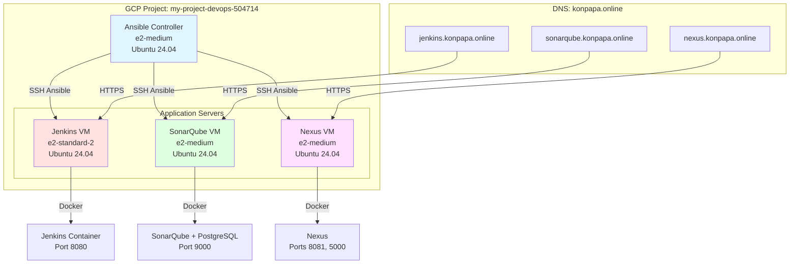

# GCP DevOps Infrastructure with Ansible

> **Automated CI/CD Infrastructure on Google Cloud Platform**
> 
> This project automates the deployment of a complete DevOps infrastructure on GCP using Ansible, featuring Jenkins, SonarQube, and Nexus Repository Manager with HTTPS support.

[](https://opensource.org/licenses/MIT)
[](https://www.ansible.com/)
[](https://cloud.google.com/)

---

## 📋 Table of Contents

- [Overview](#overview)
- [Architecture](#architecture)
- [Features](#features)
- [Prerequisites](#prerequisites)
- [Quick Start](#quick-start)
- [Detailed Setup](#detailed-setup)
- [DNS Configuration](#dns-configuration)
- [SSL Setup](#ssl-setup)
- [Service Access](#service-access)
- [Common Commands](#common-commands)
- [Troubleshooting](#troubleshooting)
- [Cost Considerations](#cost-considerations)
- [Project Structure](#project-structure)
- [Contributing](#contributing)

---

## 🎯 Overview

This project implements **Project One** from the DevOps course, creating a fully automated infrastructure where:

- **Ansible Controller VM** (GCP) manages all infrastructure
- **Jenkins** provides CI/CD pipeline capabilities
- **SonarQube** handles code quality analysis
- **Nexus Repository** manages artifacts and Docker images

All services are containerized with Docker, fronted by Nginx reverse proxy, and secured with Let's Encrypt SSL certificates.

---

## 🏗️ Architecture



### Infrastructure Components

| Component | VM Name | Machine Type | vCPU | RAM | Disk | Services |
|-----------|---------|--------------|------|-----|------|----------|
| **Jenkins** | jenkins-vm | e2-standard-2 | 2 | 8 GB | 50 GB | Jenkins, Docker, Nginx |
| **SonarQube** | sonarqube-vm | e2-medium | 2 | 4 GB | 50 GB | SonarQube, PostgreSQL 16, Nginx |
| **Nexus** | nexus-vm | e2-medium | 2 | 4 GB | 50 GB | Nexus Repository, Nginx |

---

## ✨ Features

### 🚀 Automation
- **One-command deployment** with `just deploy-all`
- **Auto-generated inventory** from GCP instance data
- **Idempotent playbooks** - safe to run multiple times
- **Automatic SSL certificate** management with Let's Encrypt

### 🔒 Security
- SSH key-based authentication
- HTTPS for all web services
- Auto-renewing SSL certificates
- Firewall rules via GCP network tags

### 📦 Services
- **Jenkins** - CI/CD pipelines with Docker support
- **SonarQube** - Code quality and security analysis
- **Nexus** - Artifact repository (Maven, npm, Docker Registry)

### 🛠️ Infrastructure as Code
- All infrastructure defined in YAML
- Version-controlled configuration
- Easy to destroy and recreate
- Cost-effective for learning

---

## 📦 Prerequisites

### Required Tools

1. **Just** - Command runner (like Make)
   ```bash
   # Install on Linux/Mac
   curl --proto '=https' --tlsv1.2 -sSf https://just.systems/install.sh | bash -s -- --to /usr/local/bin
   
   # Or via package manager
   brew install just  # macOS
   ```

2. **Google Cloud SDK**
   ```bash
   # Install gcloud CLI
   curl https://sdk.cloud.google.com | bash
   exec -l $SHELL
   gcloud init
   ```

3. **Ansible**
   ```bash
   # On Ubuntu/Debian
   sudo apt update
   sudo apt install ansible python3-pip
   pip3 install google-auth requests
   
   # Verify installation
   ansible --version
   ```

4. **SSH Keys**
   ```bash
   # Generate ED25519 key pair
   ssh-keygen -t ed25519 -C "your-email@example.com"
   ```

### GCP Requirements

- **GCP Project** with billing enabled
- **Compute Engine API** enabled
- **Project ID**: `my-project-devops-504714`
- **Region**: `asia-southeast1`
- **Zone**: `asia-southeast1-c`

### Domain Requirements

- Domain name (this project uses `konpapa.online`)
- Access to DNS management (Namecheap, Cloudflare, etc.)

---

## 🚀 Quick Start

### 1. Clone and Configure

```bash
# Clone the repository
git clone <your-repo-url>
cd ansible-gcp-devops-project

# Copy and edit configuration
cp ansible/vars/config.yaml.example ansible/vars/config.yaml
vim ansible/vars/config.yaml  # Update with your settings
```

### 2. Authenticate to GCP

```bash
# Login to GCP
gcloud auth login

# Set application default credentials (required for Ansible)
gcloud auth application-default login

# Set your project
gcloud config set project my-project-devops-504714
```

### 3. Deploy Everything

```bash
# Complete deployment (create VMs + configure services)
just deploy-all
```

This will:
1. Create 4 VMs on GCP
2. Generate dynamic inventory
3. Install Docker on all VMs
4. Deploy Jenkins, SonarQube, and Nexus
5. Configure Nginx reverse proxy
6. Display service URLs and initial passwords

### 4. Configure DNS

After VMs are created, configure DNS A records:

| Subdomain | Type | Value |
|-----------|------|-------|
| jenkins.konpapa.online | A | `<jenkins-vm-ip>` |
| sonarqube.konpapa.online | A | `<sonarqube-vm-ip>` |
| nexus.konpapa.online | A | `<nexus-vm-ip>` |

**Get the IP addresses:**
```bash
just show-inventory
# Or check GCP Console
```

### 5. Setup SSL Certificates

Once DNS is propagated (usually 5-15 minutes):

```bash
just setup-ssl
```

### 6. Access Services

```bash
# Display all service URLs
just show-urls

# Get initial passwords
just get-jenkins-password
just get-nexus-password
```

---

## 📚 Detailed Setup

### Step-by-Step Deployment

#### Step 1: Create Infrastructure

```bash
just create-infrastructure
```

**What this does:**
- Creates 4 GCP VMs with startup scripts
- Injects SSH keys into VM metadata
- Configures system settings (swap, sysctl)
- Generates `ansible/inventory/hosts.ini`
- Waits for VMs to be SSH-ready

**Duration:** ~3-5 minutes

#### Step 2: Test Connectivity

```bash
just ping-all
```

Expected output:
```
jenkins-vm | SUCCESS => {
    "changed": false,
    "ping": "pong"
}
```

#### Step 3: Configure Services

```bash
just configure-all
```

**What this does:**
- Updates all systems
- Installs Docker and Docker Compose
- Deploys Jenkins (port 8080)
- Deploys SonarQube + PostgreSQL (port 9000)
- Deploys Nexus (ports 8081, 5000)
- Configures Nginx reverse proxy
- Creates systemd services for auto-start

**Duration:** ~10-15 minutes

#### Step 4: Configure DNS

While services are deploying, configure your DNS:

**Option A: Namecheap**
1. Login to Namecheap
2. Go to Domain List → Manage
3. Advanced DNS → Add New Record
4. Type: `A Record`, Host: `jenkins`, Value: `<jenkins-vm-ip>`, TTL: Automatic
5. Repeat for `sonarqube` and `nexus`

**Option B: Cloudflare**
1. Login to Cloudflare
2. Select your domain
3. DNS → Add record
4. Type: `A`, Name: `jenkins`, IPv4 address: `<jenkins-vm-ip>`, Proxy status: DNS only
5. Repeat for `sonarqube` and `nexus`

**Verify DNS propagation:**
```bash
nslookup jenkins.konpapa.online
nslookup sonarqube.konpapa.online
nslookup nexus.konpapa.online
```

#### Step 5: Setup HTTPS

```bash
just setup-ssl
```

**What this does:**
- Installs Certbot on each VM
- Obtains Let's Encrypt SSL certificates
- Updates Nginx configs for HTTPS
- Sets up auto-renewal cron job

**Duration:** ~2-3 minutes

---

## 🌐 DNS Configuration

### Required DNS Records

| Record | Type | Name | Value | TTL |
|--------|------|------|-------|-----|
| Jenkins | A | jenkins | `<jenkins-vm-ip>` | 300 |
| SonarQube | A | sonarqube | `<sonarqube-vm-ip>` | 300 |
| Nexus | A | nexus | `<nexus-vm-ip>` | 300 |

### Get VM IP Addresses

```bash
# View all IPs
just show-inventory

# Or use gcloud
just list-gcp-instances
```

### Verify DNS

```bash
# Using nslookup
nslookup jenkins.konpapa.online

# Using dig
dig jenkins.konpapa.online +short

# Using curl (after services are running)
curl -I http://jenkins.konpapa.online
```

---

## 🔐 SSL Setup

### Automated SSL with Let's Encrypt

```bash
just setup-ssl
```

### Manual SSL (if needed)

SSH into each VM and run:

```bash
# Jenkins VM
sudo certbot --nginx -d jenkins.konpapa.online \
  --non-interactive --agree-tos -m admin@konpapa.online

# SonarQube VM
sudo certbot --nginx -d sonarqube.konpapa.online \
  --non-interactive --agree-tos -m admin@konpapa.online

# Nexus VM
sudo certbot --nginx -d nexus.konpapa.online \
  --non-interactive --agree-tos -m admin@konpapa.online
```

### SSL Certificate Renewal

Certificates auto-renew via cron at 3:30 AM daily.

**Manual renewal:**
```bash
just renew-ssl
```

**Test renewal (dry run):**
```bash
just test-ssl-renewal
```

---

## 🌍 Service Access

### Jenkins

- **URL:** https://jenkins.konpapa.online
- **Username:** `admin`
- **Password:** Get with `just get-jenkins-password`

**Initial Setup:**
1. Login with admin credentials
2. Install suggested plugins
3. Create first admin user
4. Configure system (optional: Maven, JDK, Docker)

**Useful Jenkins Plugins:**
- Docker Pipeline
- SonarQube Scanner
- Nexus Artifact Uploader
- GitHub Integration

### SonarQube

- **URL:** https://sonarqube.konpapa.online
- **Username:** `admin`
- **Password:** `admin` (change on first login)

**Initial Setup:**
1. Login with default credentials
2. Change admin password
3. Create a project
4. Generate authentication token
5. Integrate with Jenkins

### Nexus Repository

- **URL:** https://nexus.konpapa.online
- **Username:** `admin`
- **Password:** Get with `just get-nexus-password`

**Initial Setup:**
1. Login with admin credentials
2. Complete setup wizard
3. Change admin password
4. Configure repositories (Maven, npm, Docker)
5. Create deployment users

**Docker Registry:**
- **Port:** 5000
- **Usage:** `docker login nexus.konpapa.online:5000`

---

## 🛠️ Common Commands

### Infrastructure Management

```bash
# Create all infrastructure
just create-infrastructure

# Configure all services
just configure-all

# Complete deployment
just deploy-all

# Destroy everything
just destroy-infrastructure
```

### Connectivity

```bash
# Test all hosts
just ping-all

# Test specific service
just ping-jenkins
just ping-sonarqube
just ping-nexus
```

### Service Management

```bash
# Check all services
just check-services

# Restart services
just restart-jenkins
just restart-sonarqube
just restart-nexus
```

### Information

```bash
# Show service URLs
just show-urls

# Get initial passwords
just get-jenkins-password
just get-nexus-password

# Show inventory
just show-inventory
just show-inventory-graph

# Check system resources
just check-resources
```

### SSL Management

```bash
# Setup SSL certificates
just setup-ssl

# Renew certificates
just renew-ssl

# Test renewal (dry run)
just test-ssl-renewal
```

### Debugging

```bash
# Validate playbooks
just validate

# View logs
just view-logs jenkins
just view-logs sonarqube
just view-logs nexus

# Debug mode
just debug-configuration
```

### GCP Operations

```bash
# List instances
just list-gcp-instances

# SSH into VMs
just ssh-jenkins
just ssh-sonarqube
just ssh-nexus
just ssh-controller
```

---

## 🐛 Troubleshooting

### Issue: VMs not created

**Symptoms:** Playbook fails with GCP authentication error

**Solutions:**
```bash
# Re-authenticate
gcloud auth application-default login

# Verify credentials
gcloud auth list

# Check project
gcloud config get-value project
```

### Issue: Can't SSH to VMs

**Symptoms:** Ansible ping fails

**Solutions:**
```bash
# Verify SSH keys
ls -la ~/.ssh/id_ed25519*

# Check GCP firewall
just check-firewall

# Verify SSH key in GCP metadata
gcloud compute instances describe jenkins-vm --zone=asia-southeast1-c
```

### Issue: Docker containers not starting

**Symptoms:** Services show as "stopped" or failing to start

**Solutions:**
```bash
# Check Docker service
just check-services

# View container logs
just view-logs jenkins

# SSH and investigate
just ssh-jenkins
docker ps -a
docker logs jenkins
```

### Issue: SSL certificate fails

**Symptoms:** Certbot returns "DNS challenge failed"

**Solutions:**
```bash
# Verify DNS is propagated
nslookup jenkins.konpapa.online

# Wait 15 minutes after DNS changes
# Then retry
just setup-ssl

# Check Nginx configuration
just ssh-jenkins
sudo nginx -t
```

### Issue: Services unreachable via domain

**Symptoms:** curl returns "Could not resolve host"

**Solutions:**
```bash
# Verify DNS A records
dig jenkins.konpapa.online +short

# Test HTTP before HTTPS
curl -I http://jenkins.konpapa.online

# Check Nginx is running
just ssh-jenkins
sudo systemctl status nginx
```

### Issue: Out of memory

**Symptoms:** Services crash or become unresponsive

**Solutions:**
```bash
# Check resources
just check-resources

# Upgrade machine type in config.yaml
# Then recreate infrastructure
just destroy-infrastructure
just deploy-all
```

---

## 💰 Cost Considerations

### Estimated Monthly Costs (USD)

Based on 24/7 operation in `asia-southeast1`:

| Resource | Quantity | Specs | Estimated Cost/Month |
|----------|----------|-------|---------------------|
| e2-medium | 3 VMs | 2 vCPU, 4 GB RAM | ~$24 × 3 = $72 |
| e2-standard-2 | 1 VM | 2 vCPU, 8 GB RAM | ~$48 |
| Standard Persistent Disk | 200 GB total | HDD | ~$8 |
| External IP | 4 addresses | Static | ~$12 |
| **Total** | | | **~$140/month** |

### Cost Optimization Tips

1. **Stop VMs when not in use:**
   ```bash
   gcloud compute instances stop --zone=asia-southeast1-c \
     jenkins-vm sonarqube-vm nexus-vm
   ```

2. **Use preemptible VMs** (not recommended for production):
   - Edit `config.yaml`, add `scheduling.preemptible: true`
   - Saves ~70% but VMs can be terminated anytime

3. **Destroy infrastructure after learning:**
   ```bash
   just destroy-infrastructure
   ```

4. **Use smaller machine types:**
   - Reduce `e2-standard-2` to `e2-medium` for Jenkins
   - Update `config.yaml` and recreate

5. **Schedule start/stop:**
   - Use Cloud Scheduler to start VMs at 9 AM and stop at 6 PM
   - Saves ~60% of compute costs

---

## 📁 Project Structure

```
ansible-gcp-devops-project/
├── Justfile                           # Command automation
├── README.md                          # This file
├── .gitignore                         # Git ignore rules
│
├── ansible/
│   ├── ansible.cfg                    # Ansible configuration
│   │
│   ├── inventory/
│   │   ├── hosts.ini                  # Auto-generated inventory
│   │   ├── hosts.ini.example          # Example inventory
│   │   └── README.md                  # Inventory documentation
│   │
│   ├── playbooks/
│   │   ├── 01-create-infrastructure.yaml     # Create GCP VMs
│   │   ├── 02-destroy-infrastructure.yaml    # Destroy GCP VMs
│   │   ├── 03-configure-all.yaml             # Configure all services
│   │   └── gcp_instances_structure.json      # GCP response structure
│   │
│   ├── roles/
│   │   ├── common/                    # Base system configuration
│   │   │   ├── tasks/
│   │   │   │   ├── main.yaml
│   │   │   │   └── install_ohmyzsh.yaml
│   │   │   └── defaults/
│   │   │       └── main.yaml
│   │   │
│   │   ├── docker/                    # Docker installation
│   │   │   ├── tasks/
│   │   │   │   ├── main.yaml
│   │   │   │   └── install_portainer.yaml
│   │   │   └── handlers/
│   │   │       └── main.yaml
│   │   │
│   │   ├── jenkins/                   # Jenkins setup
│   │   │   ├── tasks/
│   │   │   │   └── main.yaml
│   │   │   ├── templates/
│   │   │   │   ├── docker-compose.yml.j2
│   │   │   │   ├── jenkins.env.j2
│   │   │   │   └── jenkins.service.j2
│   │   │   └── files/
│   │   │       └── jenkins-plugins.txt
│   │   │
│   │   ├── sonarqube/                 # SonarQube setup
│   │   │   ├── tasks/
│   │   │   │   └── main.yaml
│   │   │   ├── templates/
│   │   │   │   ├── docker-compose.yml.j2
│   │   │   │   ├── sonarqube.env.j2
│   │   │   │   └── sonarqube.service.j2
│   │   │   └── files/
│   │   │       └── sonarqube-setup.md
│   │   │
│   │   ├── nexus/                     # Nexus setup
│   │   │   ├── tasks/
│   │   │   │   └── main.yaml
│   │   │   ├── templates/
│   │   │   │   ├── docker-compose.yml.j2
│   │   │   │   ├── nexus.env.j2
│   │   │   │   └── nexus.service.j2
│   │   │   └── files/
│   │   │       └── nexus-setup.md
│   │   │
│   │   ├── nginx/                     # Nginx reverse proxy
│   │   │   ├── tasks/
│   │   │   │   └── main.yaml
│   │   │   ├── templates/
│   │   │   │   ├── jenkins-http.conf.j2
│   │   │   │   ├── sonarqube-http.conf.j2
│   │   │   │   └── nexus-http.conf.j2
│   │   │   └── handlers/
│   │   │       └── main.yaml
│   │   │
│   │   └── certbot/                   # SSL certificates
│   │       ├── tasks/
│   │       │   └── main.yaml
│   │       └── defaults/
│   │           └── main.yaml
│   │
│   ├── templates/
│   │   └── inventory-template.j2      # Jinja2 inventory template
│   │
│   └── vars/
│       ├── config.yaml                # Your configuration
│       └── config.yaml.example        # Configuration template
│
├── scripts/                           # Helper scripts
│   └── bootstrap-controller.sh        # Setup script for controller
│
└── docs/                              # Additional documentation
    └── architecture.md                # Architecture details
```

---

## 🤝 Contributing

This is a learning project based on the DevOps course. Feel free to:

- Fork and improve
- Report issues
- Suggest enhancements
- Share your learnings

---

## 📄 License

MIT License - feel free to use for learning purposes.

---

## 🙏 Acknowledgments

- DevOps 12 Short Course instructors
- Course repository: https://github.com/keoKAY/devoops12-shortcourse-weekend
- Based on patterns from `5.Ansible/iac-prod`

---

## 📞 Support

If you encounter issues:

1. Check the [Troubleshooting](#troubleshooting) section
2. Review service-specific setup guides:
   - `ansible/roles/jenkins/files/jenkins-plugins.txt`
   - `ansible/roles/sonarqube/files/sonarqube-setup.md`
   - `ansible/roles/nexus/files/nexus-setup.md`
3. Run diagnostics: `just check-services`
4. Check logs: `just view-logs <service>`

---

**Happy DevOps Learning! 🚀**
